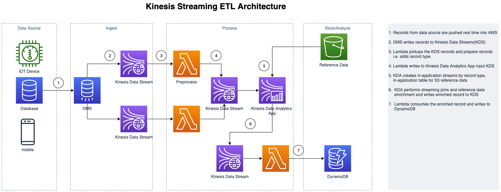
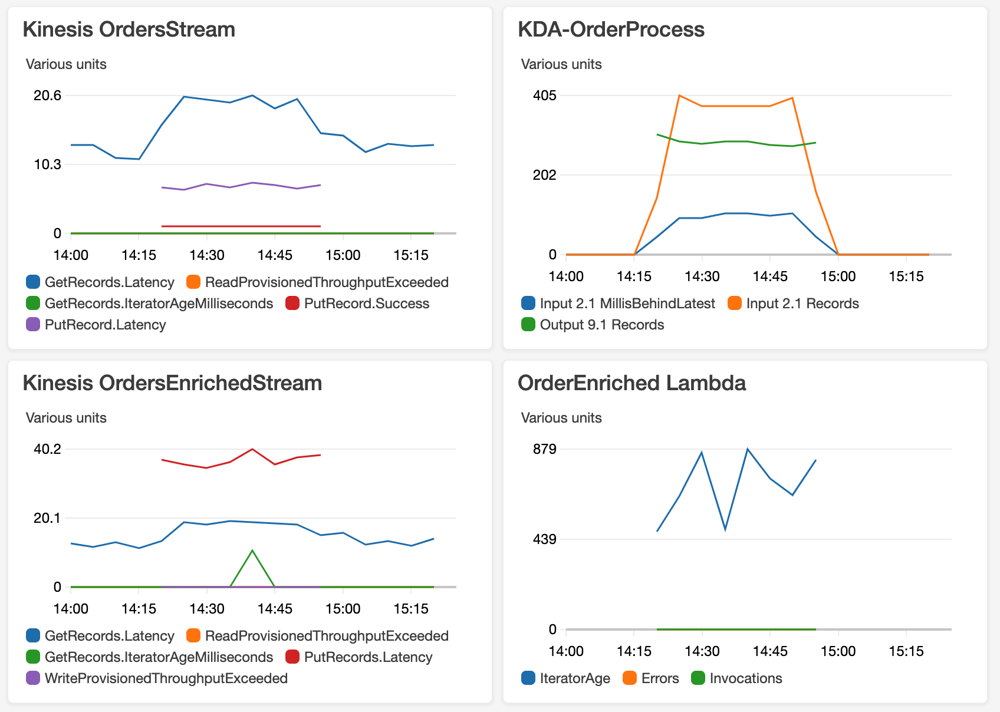

# Kinesis Streaming ETL
Demonstrates how to use Kinesis Data Streams and Kinesis Data Analytics applications to  perform streaming joins across related data streams and reference data lookup to create enriched data streams and persist it to DynamoDB

# Architecture

# How to build this architecture   

The build for this architecture simulates ingestion pipeline for Kinesis Data Analytic's input data stream using a Java process. The ingestion pipeline in this architecture is Data Source > DMS > Kinesis Data Streams > PreProcessor Lambdas.  The function of PreProcessor Lambdas is to prepare the record for streaming joins in Kinesis Data Analytics Application such as adding recordType and removing unnecessary source attributes to make stream processing efficient.  When writing to Kinesis Data Stream make sure you chose appropriate partition  key and shards to meet your scaling and sequencing needs.  

## Pre-Reqs

1. Setup JDK 8+ and Maven 3.6+ on your development workstation

## Build Steps

### Create Data Sets for ingesting events and reference data
     1. Clone/Download this repo to your workstation
     2. From command line navigate to project root folder i.e. kinesis-streaming-joins
     3. Build the jar file using mvn clean package
     4. Create S3 bucket e.g. {userid}-kinesis-orders and create folders orders, products
     5. Generate products: java -jar target/kinesis-streaming-joins-0.0.1-SNAPSHOT.jar -launchType products -productCount 1000
     6. Upload products.json to s3: aws s3 cp products.json s3://{user-id}/products/products.json
     7. Generate orders: java -jar target/kinesis-streaming-joins-0.0.1-SNAPSHOT.jar -launchType orders -orderCount 500000. For every order, it generates two child items.
     8. Upload orders.json to s3: aws s3 cp orders.json s3://{user-id}/orders/orders.json   

### Ingest order and items events to kinesis data streams
     1. Create Kinesis Data Stream - OrdersStream - with 2 shards 
     2. Clone/Download repo https://github.com/aws-samples/amazon-kinesis-replay to your workstation
     3. Go to root of the project and build jar file: mvn clean package
     4. Ingest order and item events: java -jar target/amazon-kinesis-replay-1.0-SNAPSHOT.jar -streamName {streamName} -streamRegion {region} -bucketName {userid}-kinesis-orders -bucketRegion {region} 		-objectPrefix orders -timestampAttributeName orderDateTime 
  
     
### Build Kinesis Data Analytics Application for joining orders and items streams and products reference table
     1. Go to Kinesis Data Analytics under Kinesis and create Kinesis Data Analytics Application - KDA-Orders-App - choose runtime as SQL
     2. Connect to Streaming Data Source - OrdersStream. It will automatically discover the schema for streaming data source
     2. Terminate the events ingestion from your command line using Ctrl-C
     3. Go back to KDA-Orders-App and select Connect reference data
     4. Enter your s3 bucket: <userid>-kinesis-orders and path to s3 object - products.json
     5. Name the reference table as products and select discover schema
     6. On KDA-Orders-App, select Go to SQL editor and copy the sql from this file ./resources/kda-orders-setup.sql and select save and  
        run the sql.
     7. Restart the event ingestion from command line
     8. On the KDA-Orders-App Real time analytics page, select ORDER_ITEM_ENRICHED_STREAM to see the result of joining the streaming records for order, order_item and the reference lookup for products 

### Setup Enriched Order Stream Processing
    1. Create Kinesis Data Stream - OrdersEnrichedStream - with 4 shards 
    2. On KDA-Orders-App, select connect to destination, then choose OrdersEnriched for kinesis data stream and  ORDER_ITEM_ENRICHED_STEAM for 
       in-application stream and finally save and continue.
    3. Create DynamoDB table OrdersEnriched for storing Enriched Orders. This is a denormalized table that will hold data from related records
     - orders, items and products. Define partition key - orderId(Number), sort key - itemId(Number), provisioned write capacity 2000 units, read capacity 300 units.
    4. Create nodejs Lambda - OrdersEnrichedLambdaNodeJs - copy the code from ./resources/OrdersEnrichedLambdaNodeJs.js. Set Lambda timeout to 3min, memory to 512 MB.
    5. Update the Lambda IAM role with permissions to read records from OrdersEnrichedStream and write to DynamoDB OrdersEnriched.
    6. Setup kinesis OrdersEnrichedStream as trigger for lambda,  update batch size to 500, concurrent batches to 5.
    

    
### Run tests, montior metrics and validate results
    1.   Ingest order and item events as you did in step 2.4 
    2.   Monitor metrics for Kinesis data streams - GetRecords.IteratorAgeMilliseconds, ReadProvisionedThroughputExceeded, WriteProvisionedThroughputExceeded
    3.   Monitor metrics for Lambda - Duration, IteratorAge, Error count and success rate
    4.   Monitor metrics for KDA - millisBehindLatest
    5.   Verify records and counts in DynamoDB
  
### Experiment Results

####  Experiment #1:  

#####  Inputs 

	  1. 500k Orders, 1000k Items (2 items per order related using orderId), 1k products (productId used as itemId in Items)
	  
#####  Process

	  1. Use above architecture build steps to stand up the streaming architecture 
	  2. Kinesis OrdersStream has 2 shards,  Kinesis OrdersEnrichedStream has 2 shards
	  3. Lambda code does async processing with kinesis OrdersEnrichedStream records in concurrent batches of 5 with batch size as 500
	  4. DynamoDb provisioned WCU is 3000, RCU is 300. DynamoDb has partition key orderId, sort key itemId, both as Number types
	  5. Ingest orders/items events
	  
#####  Results    

	  1. 1000K order items are enriched with order event data and product reference data and persisted to DynamoDb
	  2. Maximum pipeline latency from event ingestion(point of entry) to record landing in Dynamodb(point of exit) is 1300 millisec.
	  
#####  CloudWatch Dashboard

	  

    

 

